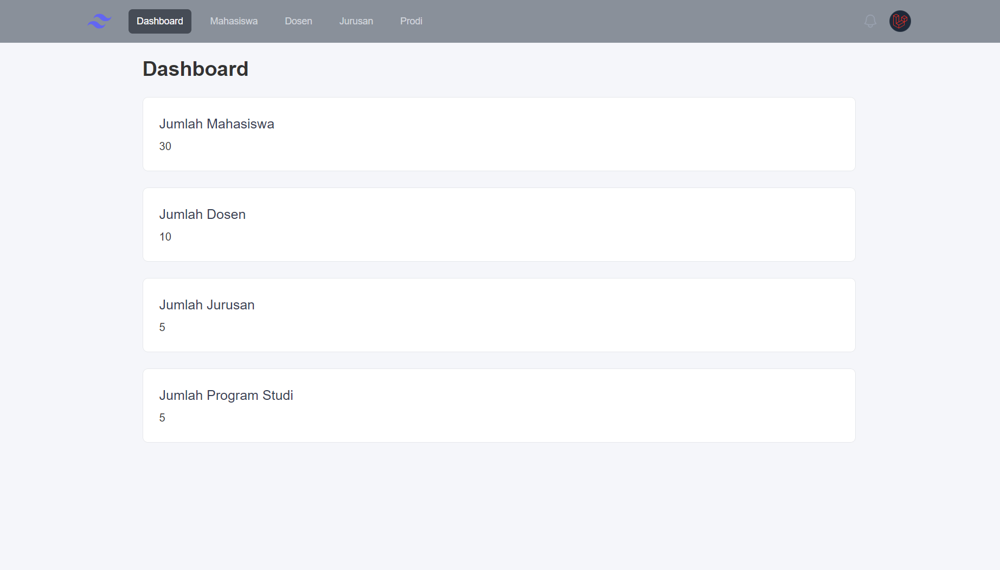
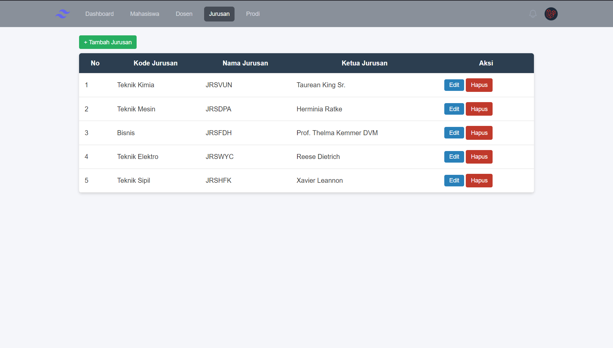
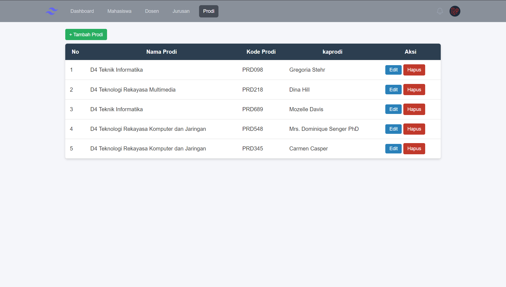
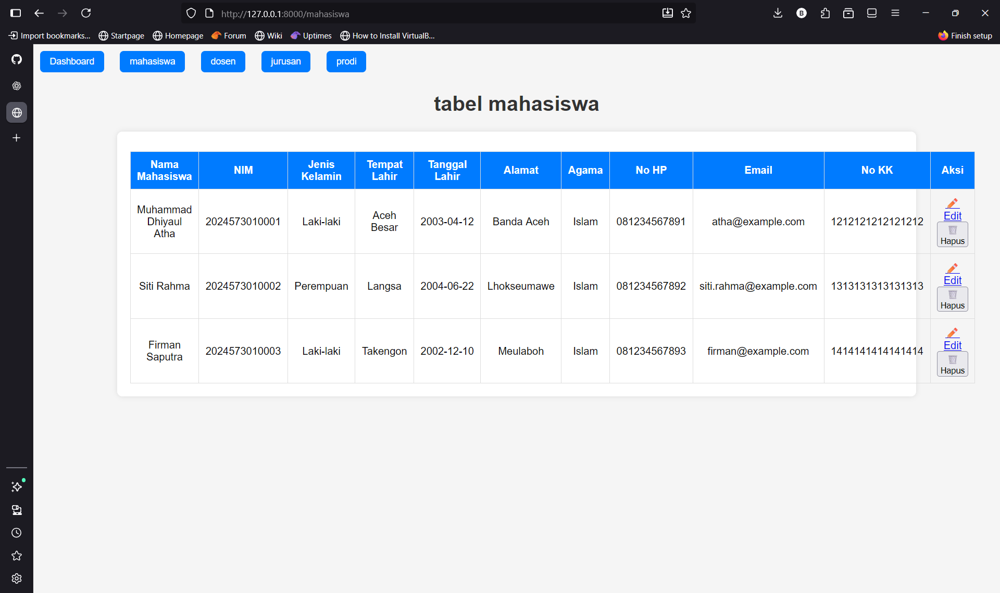
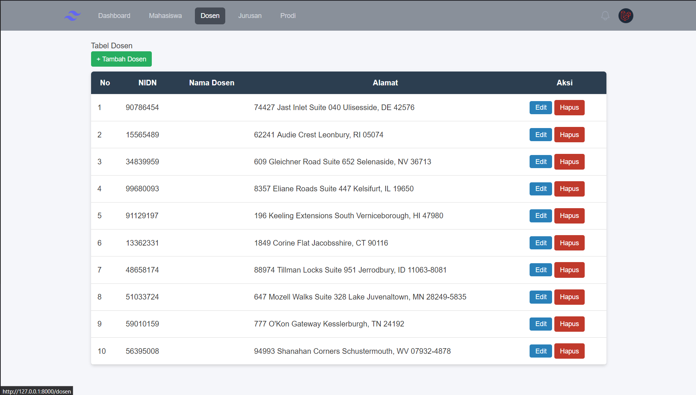

# Sistem Informasi Akademik Kampus

Sistem Informasi Akademik Kampus adalah aplikasi berbasis web yang dikembangkan menggunakan **Laravel** untuk memenuhi tugas mata kuliah **Workshop Web**.  
Aplikasi ini digunakan untuk mengelola data akademik seperti Jurusan, Program Studi, Kelas, dan Mahasiswa, dengan penerapan konsep **MVC**, **routing**, **controller**, dan **relasi antar tabel** pada database.

Tujuan pembuatan proyek ini adalah agar saya memahami alur kerja pengembangan aplikasi web modern dengan Laravel, termasuk pembuatan CRUD, integrasi database, serta pengelolaan data secara terstruktur.

---

## Fitur Utama

- CRUD Data **Jurusan**
- CRUD Data **Program Studi**
- CRUD Data **Kelas**
- CRUD Data **Mahasiswa**
- Relasi antar tabel (One to Many):
  - Jurusan → Prodi
  - Prodi → Kelas
  - Kelas → Mahasiswa
- Tampilan responsif & rapi dengan **Tailwind CSS**

---

## Teknologi yang Digunakan

| Teknologi / Tools | Peran |
|------------------|-------|
| Laravel | Backend & Routing |
| Blade | Template View Engine |
| MySQL | Database |
| Tailwind CSS | Styling Frontend |
| Vite | Asset Bundler |
| Composer | Manajemen Dependency PHP |
| NPM | Build dan Compile Asset |

---

## Dokumentasi Tampilan

| Halaman | Screenshot |
|--------|------------|
| Dashboard |  |
| Data Jurusan |  |
| Data Program Studi |  |
| Data Mahasiswa |  |
| Data Dosen | |

---

## Dev
**Nama:** Muhammad Dhiyaul Atha  
**Mata Kuliah:** Workshop Web  
**Program Studi:** Teknik Informatika  

---

## Repositori
https://github.com/Bangkah/akademik
